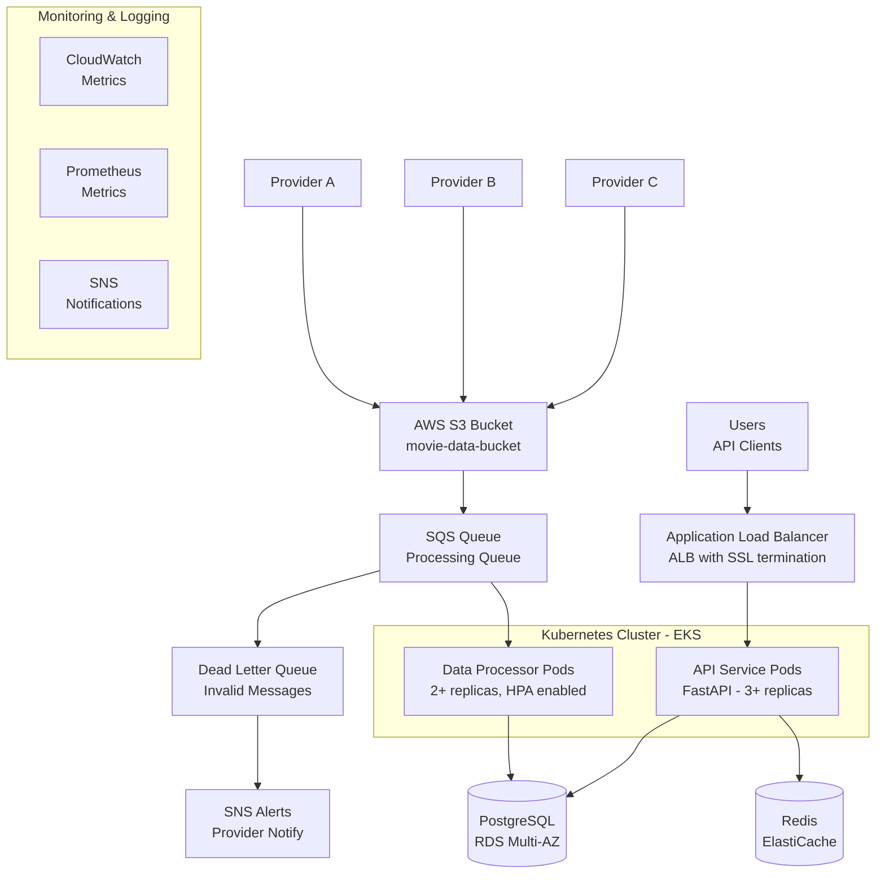

# Movie Store Platform Architecture

## High-Level Architecture Diagram



## Data Flow Description

### 1. Data Ingestion Flow
```
Provider → S3 Upload → SQS Queue → Data Processor → PostgreSQL Database
```

**Steps:**
1. **Provider uploads** JSON movie data to S3 bucket (`providers/{provider-name}/`)
2. **S3 event** triggers SQS message containing file location
3. **Data processor** polls SQS and validates JSON structure, schema, and business rules
4. **Valid data** stored in PostgreSQL and cached in Redis
5. **Invalid data** sent to Dead Letter Queue (DLQ) with SNS notification to provider

### 2. API Request Flow
```
User → ALB → API Pod → Cache Check → PostgreSQL Query → Response
```

**Steps:**
1. **User request** hits Application Load Balancer
2. **ALB routes** to available API pod (round-robin)
3. **API service** checks Redis cache first
4. **Cache miss** triggers optimized PostgreSQL query with indexes
5. **Results cached** for future requests
6. **JSON response** returned to user

## Key Architecture Decisions

### **High Availability Design**
- **Multi-AZ deployment** across 3 availability zones
- **Pod anti-affinity** spreads replicas across nodes
- **Horizontal Pod Autoscaler** scales based on CPU/memory
- **Pod Disruption Budgets** ensure minimum availability during updates

### **Security Implementation**
- **VPC isolation** with private subnets for databases
- **IAM roles** with least privilege access
- **Secrets Manager** for credential management
- **Encryption** at rest and in transit for all data stores
- **Security contexts** for pods (non-root, read-only filesystem)

### **Performance Optimization**
- **Redis caching** for sub-millisecond reads
- **PostgreSQL indexes** on year, title, genre, cast for fast queries
- **Connection pooling** for database efficiency
- **Async Python** for non-blocking I/O operations

### **Monitoring & Observability**
- **CloudWatch** for AWS service metrics
- **Prometheus** for Kubernetes metrics
- **SNS alerts** for validation errors
- **Structured logging** with correlation IDs

## Scalability Characteristics

| Component | Min Replicas | Max Replicas | Scaling Trigger |
|-----------|-------------|-------------|-----------------|
| API Service | 3 | 10 | CPU 70%, Memory 80% |
| Data Processor | 2 | 5 | CPU 80%, Memory 85% |
| PostgreSQL | 1 | Read Replicas | Manual |
| Redis | 1 | 3 (Cluster) | Environment-based |

## Disaster Recovery

- **RDS automated backups** with point-in-time recovery
- **ElastiCache snapshots** for cache state preservation  
- **Multi-AZ deployment** for automatic failover
- **Infrastructure as Code** for rapid environment recreation

